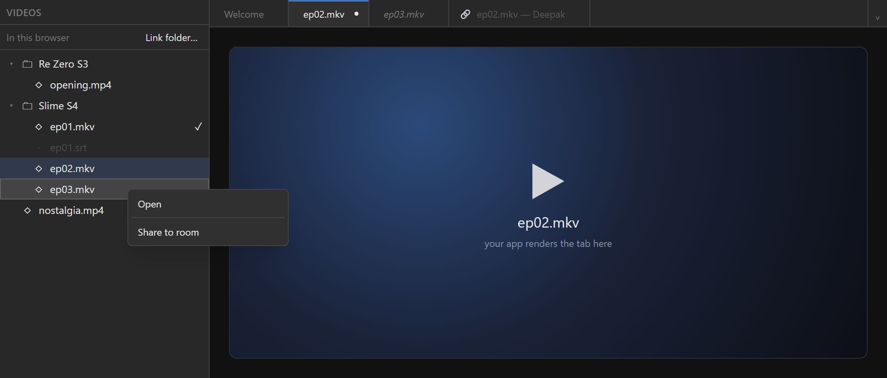

<h1 align="center">easy-folder-management-ui</h1>

<p align="center">
  <strong>A VS Code-style file library and tab strip for web apps.</strong><br />
  Link a folder on the user's disk or keep files in the browser, browse them in a tree, open them in tabs —
  without ever loading a 4&nbsp;GB file into memory.
</p>

<p align="center">
  <a href="https://www.npmjs.com/package/@theclearsky/easy-folder-management-ui"></a>
  <a href="https://github.com/TheClearSky/easy-folder-management-ui/actions/workflows/library-deploy.yml"></a>
  
  
  <a href="./LICENSE"></a>
</p>

<p align="center">
  <a href="https://www.npmjs.com/package/@theclearsky/easy-folder-management-ui">npm</a> ·
  <a href="https://github.com/TheClearSky/easy-folder-management-ui">GitHub</a> ·
  <a href="#quick-start">Quick start</a> ·
  <a href="#recipes">Recipes</a> ·
  <a href="#api-at-a-glance">API</a> ·
  <a href="#-styling--theming">Theming</a> ·
  <a href="./CHANGELOG.md">Changelog</a>
</p>

<p align="center">
  
</p>

---

## Why

Every app that edits or plays files ends up rebuilding the same things: a file tree, tabs, "unsaved changes?",
re-asking for folder permission, not losing an edit when the user switches tabs mid-save. This package is those
pieces, extracted from a production app, generalized, and tested.

|  |  |
|---|---|
| 📁 **Real folders, or none** | Link a folder with the File System Access API, or keep files in the browser (IndexedDB + OPFS). Read-only or read & write — shown as a tag, switchable, remembered. Reconnect after a reload with one click. Unlink keeps a copy in the browser, or leaves it empty — your choice. |
| 🎞️ **Binary-safe** | `getFile()` returns the browser's disk-backed `File` — an object URL plays a 4&nbsp;GB video without reading it. Writes take streams and resume at an offset; folder moves copy through streams; keeping an unlinked folder streams it into the Origin Private File System, with progress and Cancel. |
| 🗂️ **Tabs that aren't only files** | Tab ids are `kind:key` — files, a Welcome page, or anything your app defines (a live stream). MRU focus, reopen, drag reorder, optional VS Code preview tabs, restored by path after a reload. |
| 🛟 **Doesn't lose work** | A framework-free `Workspace` handles open / switch / close with race guards, autosave, unsaved-changes prompts, on-disk conflict detection, a crash journal and per-tab snapshots. |
| 🎨 **Styled, isolated, themeable** | Ships its own stylesheet: every class is prefixed `efm:`, there is no global reset. Restyle every surface from one typed theme (slot classes, `--efm-*` variables, a light preset) — your classes win conflicts deterministically. Works next to your own Tailwind (or none). |
| ♿ **Keyboard-first** | WAI-ARIA tree and tabs: arrows, Home/End, F2 rename, Delete, Ctrl+Shift+←/→ to move a tab, Shift+F10 menus (Radix). |

## Install

```sh
npm install @theclearsky/easy-folder-management-ui
```

`react` and `react-dom` (18+) are optional peers — only the `./react` and `./ui` entries use them. The core runs
anywhere, Node included.

| Entry | What's in it |
|---|---|
| `@theclearsky/easy-folder-management-ui` | Core: `FileLibrary`, backends, `FilePolicy`, tabs reducer, tab kinds, `Workspace`, `SaveController` |
| `…/react` | `useWorkspace`, `useLibrarySnapshot` |
| `…/ui` | `FileSidebar`, `TabStrip`, `WelcomeLayout`, `EmptyState`, `Toaster`, `useChoiceDialog` (+ `accessChoice`, `unlinkChoice`, `confirmChoice`, `unlinkProgressView`), `useUnsavedChangesDialog`, `FolderThemeProvider` (+ `EfmTheme`, presets), … |
| `…/styles.css` | The stylesheet for `./ui` (import once) |

## Quick start

A Markdown notes app: link a folder, open notes in tabs, edit, autosave.

```tsx
import { useState } from 'react';
import {
  canLinkFolders,
  createIndexedDbStore,
  defineTabKinds,
  extensionPolicy,
  FileLibrary,
  pickFolder,
  Workspace,
} from '@theclearsky/easy-folder-management-ui';
import { useWorkspace } from '@theclearsky/easy-folder-management-ui/react';
import { FileSidebar, TabStrip } from '@theclearsky/easy-folder-management-ui/ui';
import '@theclearsky/easy-folder-management-ui/styles.css';

// 1. Which files your app opens.
const policy = extensionPolicy({ openable: ['.md'], content: 'text', defaultExtension: '.md' });

// 2. A library (where files live) and a workspace (what's open).
let editorText = '';
function createWorkspace(show: (text: string | null) => void) {
  const library = new FileLibrary({ store: createIndexedDbStore('notes.library'), policy });
  return new Workspace<string>({
    library,
    kinds: defineTabKinds({ file: { persist: 'file' }, welcome: { persist: 'key' } }),
    documents: {
      load: async (file) => ({ ok: true, content: await file.readText() }),
      install: (text) => show((editorText = text)),
      closeEditor: () => show(null),
      serialize: () => editorText, // present → the workspace autosaves
    },
  });
}

// 3. Render it.
export function NotesApp() {
  const [text, setText] = useState<string | null>(null);
  const { workspace, snapshot } = useWorkspace(() => createWorkspace(setText));
  return (
    <div style={{ display: 'flex', height: '100vh' }}>
      <FileSidebar
        snapshot={snapshot.library}
        policy={policy}
        activeFileId={snapshot.activeFileId}
        readOnly={snapshot.readOnly}
        canLinkFolders={canLinkFolders()}
        onOpen={(id, { preview }) => void workspace.openFile(id, { preview })}
        onNewFile={(folder) => void workspace.createAndOpen(folder, 'Untitled.md', '')}
        onRename={(id, name) => void workspace.rename(id, name)}
        onDelete={(ids) => void workspace.remove(ids)}
        // The picker first, straight from the click (it needs the user gesture).
        onLink={() => void pickFolder().then((folder) => folder && workspace.link(folder))}
        onReconnect={() => void workspace.reconnect()}
      />
      <div style={{ flex: 1, display: 'flex', flexDirection: 'column' }}>
        <TabStrip
          order={snapshot.tabs.order}
          active={snapshot.tabs.active}
          preview={snapshot.tabs.preview}
          label={(id) => workspace.label(id)}
          isDirty={(id) => workspace.isDirty(id)}
          status={(id) => (workspace.isTabMissing(id) ? 'missing' : 'ok')}
          onActivate={(id) => void workspace.activateTab(id)}
          onClose={(ids) => void workspace.closeTabs(ids)}
          onReorder={(id, to) => workspace.reorderTab(id, to)}
          onPromote={(id) => workspace.promoteTab(id)}
          onReopen={() => void workspace.reopenClosedTab()}
          panelId='editor'
        />
        <textarea
          id='editor'
          value={text ?? ''}
          disabled={text === null}
          onChange={(event) => {
            setText((editorText = event.target.value));
            workspace.contentChanged();
          }}
        />
      </div>
    </div>
  );
}
```

`npm run playground` in this repo renders every component on a bare page.

## Recipes

### A read-only video library

```ts
const library = new FileLibrary({
  store: createIndexedDbStore('videos.library'),
  policy: extensionPolicy({ openable: ['.mp4', '.mkv', '.webm'], content: 'binary' }),
  access: 'read', // the browser asks for read access only; every change is refused
});

const workspace = new Workspace<File>({
  library,
  kinds: defineTabKinds({ file: { persist: 'file' }, welcome: { persist: 'key' } }),
  documents: {
    // Disk-backed: nothing is read until the <video> asks for it.
    load: async (file) => ({ ok: true, content: await file.getFile() }),
    install: (video) => (player.src = URL.createObjectURL(video)),
    closeEditor: () => player.removeAttribute('src'),
  },
});
```

Need to write after all (say, saving a download)? `await library.setAccess('readwrite')` from a click upgrades the
link (the browser asks; a refusal keeps it read-only and says so in the snapshot's `notice`). The choice is remembered
for that folder. `access` is only the default for new links — see the next recipe to let the user choose.

### Link read-only or read & write, unlink with keep or remove

```tsx
import { pickFolder } from '@theclearsky/easy-folder-management-ui';
import type { FilePolicy, Workspace, WorkspaceOptions } from '@theclearsky/easy-folder-management-ui';
import {
  accessChoice,
  confirmChoice,
  FileSidebar,
  unlinkChoice,
  unlinkProgressView,
  useChoiceDialog,
} from '@theclearsky/easy-folder-management-ui/ui';
import { useWorkspace } from '@theclearsky/easy-folder-management-ui/react';

// Your video workspace (the recipe above), with the two prompts passed in.
declare function createVideoWorkspace(prompts: Pick<WorkspaceOptions<File>, 'confirm' | 'chooseUnlink'>): Workspace<File>;
declare const policy: FilePolicy;

export function Library() {
  const dialog = useChoiceDialog(); // one accessible <dialog> for every question
  const { workspace, snapshot } = useWorkspace(() =>
    createVideoWorkspace({
      confirm: async (request) => (await dialog.ask(confirmChoice(request))) === 'confirm', // link, delete
      chooseUnlink: (plan) => dialog.ask(unlinkChoice(plan)), // 'keep' | 'remove' | 'cancel'
    }),
  );
  const link = async () => {
    const access = await dialog.ask(accessChoice()); // 'read' | 'readwrite' | 'cancel'
    if (access === 'cancel') return;
    // The click on a choice is a fresh user gesture, so the picker can open now.
    const folder = await pickFolder({ access });
    if (folder) await workspace.link(folder, { access });
  };
  const unlink = () =>
    void workspace
      .unlink({
        // KEEP streams the folder into the browser: show the copy, with Cancel.
        onProgress: (progress) => dialog.showProgress(unlinkProgressView(progress, () => workspace.cancelUnlink())),
      })
      .finally(() => dialog.showProgress(null));
  return (
    <>
      <FileSidebar
        snapshot={snapshot.library}
        policy={policy}
        activeFileId={snapshot.activeFileId}
        readOnly={snapshot.readOnly}
        canLinkFolders
        onOpen={(id) => void workspace.openFile(id)}
        onLink={() => void link()}
        onUnlink={unlink}
        // The "Read only" / "Read & write" tag becomes a menu; an upgrade asks the browser from this click.
        onChangeAccess={(access) => void workspace.setFolderAccess(access)}
        // A read & write folder whose permission is gone after a reload: Reconnect, or continue "Read only".
        onReconnect={(access) => void workspace.reconnect({ access })}
        onDelete={(ids) => void workspace.remove(ids)}
        onRename={(id, name) => void workspace.rename(id, name)}
      />
      {dialog.element}
    </>
  );
}
```

What happens, and the edge cases handled:

- **Unlink → Keep a copy**: `library.planUnlink()` measures first (file sizes from metadata, `navigator.storage.estimate()`
  free space); the dialog shows both and disables Keep when it will not fit. The copy streams each file
  (`file.stream().pipeTo(…)`) into an OPFS directory the library owns (`<store name>.blobs`), asks for
  `navigator.storage.persist()`, and is **all-or-nothing**: out of space, a failure or Cancel deletes the partial copy
  and leaves the folder linked, unchanged. Folders on disk come along, empty ones too; files the policy's
  `copyOnUnlink` refuses stay on disk only. Afterwards `getFile()` returns the OPFS copy as a disk-backed `File`.
- **Unlink → Remove**: the in-browser library ends up empty. Nothing on disk is ever touched either way.
- **Access**: stored next to the folder handle, so a reload asks the browser for *that* access. Downgrading saves the
  open file's pending edit and waits for queued writes; writes in read-only mode are refused with "This folder is open
  read-only. Switch it to Read & write to change it."
- **Delete in the browser library** frees the OPFS bytes at once. Binary files are not kept for Undo, so the confirm
  says "This cannot be undone" and no Undo is offered; text files (and folders alone) can be undone until a reload.
- **Where bytes live**: `blobStore: 'auto'` (default) uses OPFS for a `'binary'` policy over `createIndexedDbStore`.
  Text is always a string in IndexedDB (`file:<id>`, the format older libraries hold). With `createMemoryStore`, or
  where OPFS is refused, binary contents stay Blobs in the key-value store (in memory for a memory store).

### Stream a large file to disk, and resume

```ts
const id = await library.createFile(folderId, 'movie.mkv.part', firstChunks); // ReadableStream
await library.write(id, moreChunks, { at: bytesAlreadyWritten });             // resume after a blip
```

A failed stream leaves the previous contents untouched (the browser commits on close). Hide `*.part` from the tree
with your policy's `isHidden`.

### Tabs your app owns

```ts
const kinds = defineTabKinds({
  file: { persist: 'file' },   // restored by path
  welcome: { persist: 'key' }, // restored as-is
  share: { persist: false },   // a live stream: gone after a reload
});
await workspace.openTab(tabId('share', 's_9f2c'));
```

Give non-file tabs a label with the workspace's `label` option and a status (`ended`, `loading`, …) with
`TabStrip`'s `status` prop.

### Preview tabs (VS Code's italic tab)

`FileSidebar previewOnClick` opens on single click as a preview that the next single click replaces; a
double-click, an edit or `promoteTab` keeps it.

## API at a glance

| | |
|---|---|
| `extensionPolicy({ openable, content, defaultExtension?, isHidden?, copyOnUnlink?, keepForUndo? })` | What opens, what a scan skips, what Unlink → Keep copies (openable files by default) and what Undo keeps (text only) |
| `new FileLibrary({ store, policy, access?, blobStore?, beforeMutate? })` | `init` · `link(handle, { access? })` · `planUnlink()` · `unlink({ keep, signal?, onProgress? })` · `cancelUnlink` · `setAccess(access)` · `reconnect({ access? })` · `rescan` · `getFile` · `readText` · `write` · `createFile` · `createFolder` · `rename` · `move` · `remove` · `undoDelete` · `requestWriteAccess` (= `setAccess('readwrite')`) |
| `createIndexedDbStore(name)` / `createMemoryStore()` | Where the library persists (a folder handle survives a reload only in IndexedDB) |
| `createOpfsBlobStore(dir)` / `createMemoryBlobStore()` · `estimateStorage()` · `requestPersistentStorage()` | Where binary contents of the in-browser library live (OPFS by default for binary policies) |
| `pickFolder({ access?, id? })` · `canLinkFolders()` | The folder picker, and whether this browser has one |
| `new Workspace({ library, kinds, documents, confirm?, chooseUnlink?, … })` | `openFile` · `openTab` · `activateTab` · `closeTabs` (+ others / right / saved / all) · `reopenClosedTab` · `promoteTab` · `reorderTab` · `contentChanged` · `saveNow` · `setAutoSave` · `overwriteConflict` · `reloadConflict` · `link(handle, { access? })` · `unlink({ signal?, onProgress? })` · `cancelUnlink` · `setFolderAccess(access)` · `reconnect({ access? })` · `rename` · `move` · `remove` |
| `DocumentAdapter` | Required: `load`, `install`, `closeEditor`. Optional: `serialize` (enables saving), `signature`, `capture` / `restore` (per-tab snapshots), `silence`, `onFirstSaveOfWarnedFile` |
| `tabsReducer` · `tabId` · `parseTabId` · `defineTabKinds` · `createTabRecordStore` | The tabs model on its own, if you don't want the workspace |

Prompts are yours: pass `confirmUnsaved` (e.g. `useUnsavedChangesDialog().ask`), `confirm` and `chooseUnlink` to the
workspace (`useChoiceDialog()` with `confirmChoice` / `unlinkChoice` words them) — the library never calls
`window.confirm`. The snapshot carries `library.folderAccess` and `library.unlinkProgress`, so a UI re-renders when
either changes.

## 🎨 Styling & theming

The components ship styled and isolated — every class is prefixed `efm:`, there is no global reset — and every
visible surface can be restyled from one optional, typed theme object: a map of per-component, per-slot class names,
deep-merged over a named preset (`'default'` | `'light'`). Same pattern as react-blender-nodes' `GraphThemeProvider`.

```tsx
import type { ReactNode } from 'react';
import { FolderThemeProvider } from '@theclearsky/easy-folder-management-ui/ui';
import type { EfmTheme } from '@theclearsky/easy-folder-management-ui/ui';
import '@theclearsky/easy-folder-management-ui/styles.css';

// Written with YOUR Tailwind: plain, unprefixed classes.
const warm: EfmTheme = {
  fileSidebar: {
    root: '[--efm-surface:#241c17] [--efm-accent:#e9a55a]', // var overrides: everything inside follows
    rowActive: 'bg-amber-500/20 text-amber-100', // a STATE slot: only the open file's row
  },
  tabStrip: { root: '[--efm-surface:#241c17]', tabActive: 'shadow-[inset_0_-2px_0_#e9a55a]' },
  menu: { content: '[--efm-surface-raised:#2f251e] rounded-xl' }, // menus are portaled: own slot
};

export function ThemedLibrary({ children }: { children: ReactNode }) {
  return <FolderThemeProvider theme={warm}>{children}</FolderThemeProvider>;
}
```

Without a provider nothing changes. Inline `theme={{ … }}` literals are fine (resolution is memoised by content), and
the innermost provider wins. Each slot is appended after the component's defaults and before its `className` prop;
`cn` keeps only the last class per CSS property, so `bg-amber-500/20` REPLACES `efm:bg-…` in the DOM — no
specificity fights, no dependence on stylesheet order.

**Three mechanisms**, freely combined:

1. **Slot classes** — `fileSidebar`, `tabStrip`, `menu` (shared by every menu), `choiceDialog`, `unsavedDialog`,
   `toaster`, `welcome`, `emptyState`, `panelError`; the full slot map is in [docs/theming.md](./docs/theming.md).
   State slots (`rowSelected`, `tabActive`, `overflowItemActive`, …) apply only in their state; a base slot (`row`,
   `tab`) applies in every state.
2. **CSS-variable overrides on a root slot** — every colour is a `--efm-*` token read through `var()`, so
   `[--efm-accent:#e9a55a]` on `fileSidebar.root` recolours the whole sidebar. The same variables work from plain
   CSS, no Tailwind needed:

   ```css
   :root {
     --efm-surface: #ffffff;
     --efm-surface-raised: #f4f5f7;
     --efm-border: #dfe1e6;
     --efm-fg: #172b4d;
     --efm-fg-muted: #5e6c84;
     --efm-accent: #0c66e4;
   }
   ```

3. **Descendant variants** — restyle a default class deeper inside a slot, for an element without a slot of its
   own: `'[&_[class~="efm:text-fg-muted"]]:text-amber-400'`, or with the escaped class selector
   ``String.raw`[&_.efm\:text-fg-muted]:text-amber-400` ``. The selected class is one of ours, so it carries the
   prefix, and its `:` must be escaped as `efm\:` — with ONE backslash in the source Tailwind scans as well as at
   runtime. An ordinary `'…efm\\:…'` literal has two in the source and silently matches nothing; use `String.raw`
   or the escape-free attribute form.

| Variable | Used for | | Variable | Used for |
|---|---|---|---|---|
| `--efm-font` | text (inherits) | | `--efm-fg` | text |
| `--efm-surface` | sidebar, strip | | `--efm-fg-muted` | secondary text |
| `--efm-surface-raised` | active tab, menus, dialogs | | `--efm-fg-disabled` | inert files |
| `--efm-surface-sunken` | Welcome, inputs | | `--efm-accent` | active, open file, drop target, primary |
| `--efm-border` / `--efm-hover` | lines / hover, selection | | `--efm-warning` · `--efm-danger` | unsaved · errors |
| `--efm-on-accent` | text on accent/danger buttons | | `--efm-overlay` | dialog backdrop |
| `--efm-focus` | focus rings (unset → accent) | | `--efm-selection` | open file's row (unset → accent 25 %) |

**Classes you write need your own Tailwind build.** The built-in presets' classes ship in `styles.css`; yours exist
only if your Tailwind (v4) scans the file that contains them — otherwise the class matches no rule and silently does
nothing. Unprefixed classes are the natural choice. Var overrides from your own CSS are the no-Tailwind escape hatch.

**Portals.** The menus render into `document.body`, outside the sidebar and the strip: the theme reaches them (React
context crosses portals), root var overrides do not — put them on `menu.content` too, or set the variables on
`:root`. The dialogs render where you place `dialog.element` and inherit variables from there; theme them through
their `panel` slot (which also takes `backdrop:` classes).

Pass `className` to any component for a one-off: it comes after the theme and wins.

## Browser support

| | Chrome / Edge | Firefox | Safari |
|---|---|---|---|
| In-browser library, tabs, workspace, UI | ✅ | ✅ | ✅ |
| Link a local folder | ✅ desktop | — (no File System Access) | — |

`canLinkFolders()` tells you which; `FileSidebar` explains it to the user when linking is unavailable.

## Built to be trusted

- **186 tests.** The core's run in Node against an in-memory File System Access implementation, stripped to what
  stable Chrome supports, so a test never passes only because the fake is more capable than the browser; the theme's
  render every component in jsdom and check that every slot lands on its element, portaled menus included.
- The OPFS copy is verified in real Chrome: a 202&nbsp;MB folder kept byte for byte (streamed check), progress
  events, Cancel mid-copy leaving nothing behind, survival across a reload — with the page's JS heap unchanged.
- The workspace's tests pin the data-loss bugs found and fixed in production: an edit made while switching tabs is
  saved to the right file, a superseded open restores what it took, "Don't save" sticks, a file changed on disk is
  never overwritten without asking.
- Every release is built and published by CI with npm provenance.

## Used by

| Project | Status |
|---|---|
| **watch-together** — watch local videos together, peer to peer, from a static page | coming soon |
| **Nodestra** — a node-based sound design app (where this library was born) | migration coming soon |

## License

MIT © 2026 Deepak Prasad
